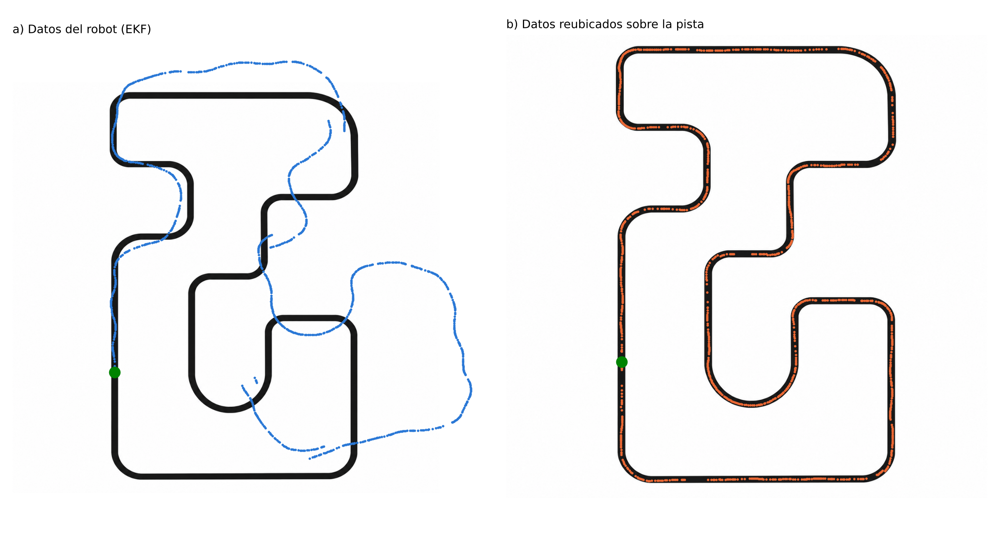

# Reto 1 · Mapeo de trayectoria con robot XRP

**Actuadores y Sensores — Universidad EAFIT, 2026-2** · Profesor: Felipe Mendoza Giraldo
David Zuluaga Henao · Lucas Arango Botero · Nicolás Zapata Jurado

El robot XRP sigue una línea, estima su posición (x, y, θ) fusionando **encoders**, **giroscopio** y un **LiDAR 360°** con un **filtro de Kalman extendido**, y guarda el recorrido en `datos.txt`.

▶ **Video del robot en la pista:** https://youtube.com/shorts/agATlmuYTp4?feature=share
🌐 **Sitio con simulador:** _(enlace de Vercel)_

[](https://youtube.com/shorts/agATlmuYTp4?feature=share)

## Contenido

| Carpeta | Qué hay |
|---|---|
| [`robot/reto1_xrp.py`](robot/reto1_xrp.py) | Programa de la XRP (MicroPython + XRPLib): seguidor de línea, control de velocidad por rueda, LiDAR, PL-ICP, EKF y registro. |
| [`datos/`](datos) | `datos.txt` (trayectoria del EKF), `datos_reubicados_pista.csv` y `datos_reubicados.txt` (puntos ubicados sobre la pista). |
| [`informe/`](informe) | Informe (Word y PDF) y figuras. |
| [`analisis/ubicar_en_pista.py`](analisis/ubicar_en_pista.py) | Script que escala el plano, encuentra la salida y reubica los puntos sobre la pista (map matching con DTW). |
| [`web/`](web) | Sitio estático con el simulador pixel art (desplegado en Vercel). |

## Cómo funciona el robot

| Nivel | Frecuencia | Qué hace |
|---|---|---|
| Marcha | 100 Hz | Seguidor de línea (PD + amortiguamiento con el giroscopio) y PI de velocidad en cada rueda con prealimentación. |
| Predicción | 10 Hz | Δs de los encoders (r = 3,0 cm, 585 cuentas/vuelta) y Δθ del giroscopio; modelo diferencial con θ en el punto medio. Q depende de lo recorrido y lo girado. |
| Corrección | por barrido | PL-ICP punto-a-línea entre barridos del LiDAR (keyframes cada 12 cm / 12°). EKF con H = I, forma de Joseph y validación χ² (3 GDL, 99 %). |

Durante el recorrido el LiDAR trabaja en **modo diferido**: solo guarda barridos; al llegar a la meta el robot repite el EKF con el ICP y escribe los archivos. Así el control de las ruedas nunca espera.

## Resultados del recorrido real

- 1090 puntos, 752 cm medidos por los encoders; giro total ≈ −360°.
- Pista real: 99,4 × 198,5 cm (perímetro de la línea central ≈ 811 cm).
- Los primeros 170 cm coinciden con la pista con un error medio de 4,5 cm; el error de cierre final es de 57,7 cm (7,7 % de la distancia).
- El plano en imagen **no está a escala** (relación 1,58 frente a 2,0 real); por eso los puntos no coincidían al dibujarlos sobre él.



## Simulador web

`web/` contiene un simulador del mismo código del robot, portado a JavaScript: física de motores, deslizamiento, ruido de encoders/giroscopio/reflectancia, LiDAR por trazado de rayos, PL-ICP y EKF. Render pixel art con animación procedural (ruedas, LiDAR, LED de estado, cables, inclinación por aceleración, polvo).

Para verlo localmente:

```bash
cd web
python -m http.server 8000
# abrir http://localhost:8000
```

## Reproducir el análisis

```bash
cd analisis
pip install -r requirements.txt
python ubicar_en_pista.py ../datos/datos.txt pista_vista_superior.png
```
